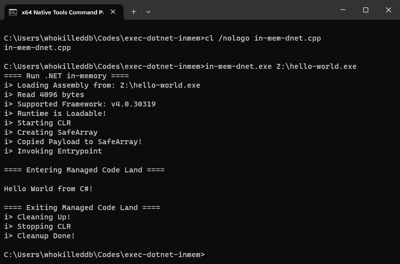

# Exec-Assembly

Run .NET assemblies from Memory. Inspired by Cobalt Strike's `execute-assembly`!

## Sample C# Code

```c#
// A Hello World! program in C#.
using System;
namespace HelloWorld
{
    class Hello 
    {
        static void Main() 
        {
            Console.WriteLine("Hello World!");
        }
    }
}
```

Compile the C# code with:
```
csc /nologo helloworld.cs
```

## Run the Code

Once compiled with `Visual Studio`, you can run the code with: 

```
exec-assembly.exe path\to\assembly
```

